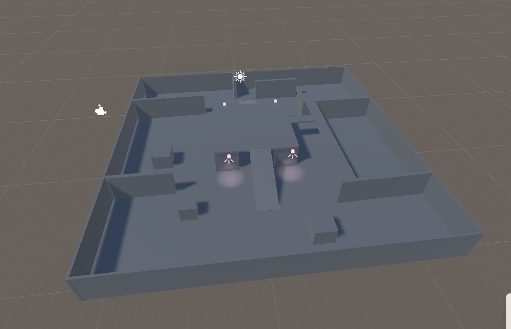
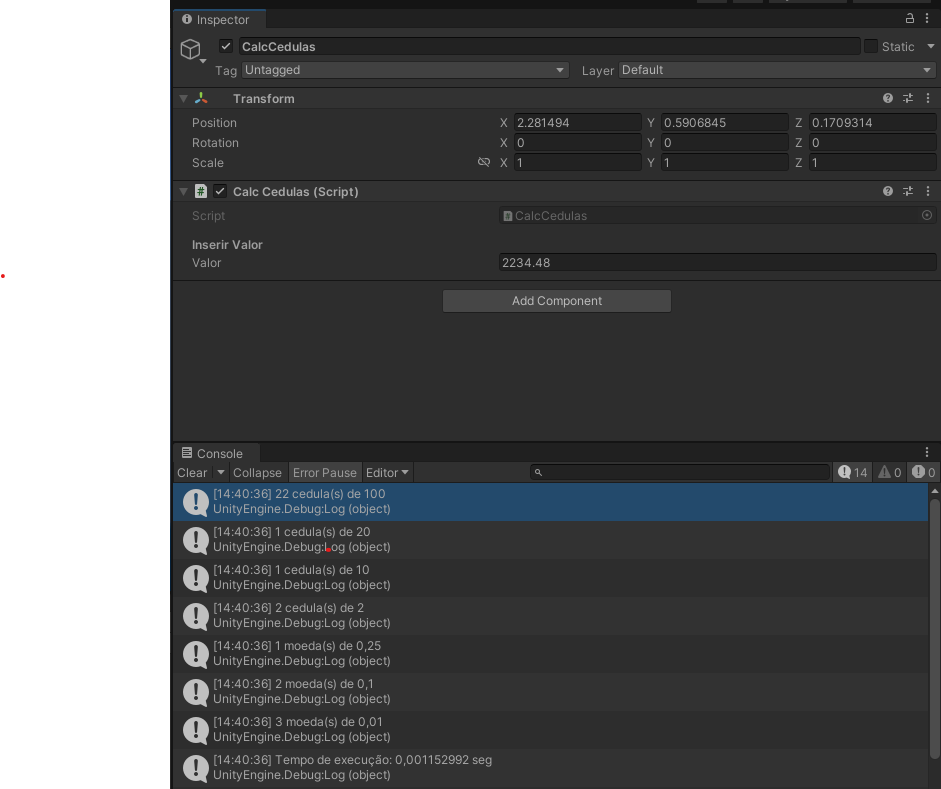
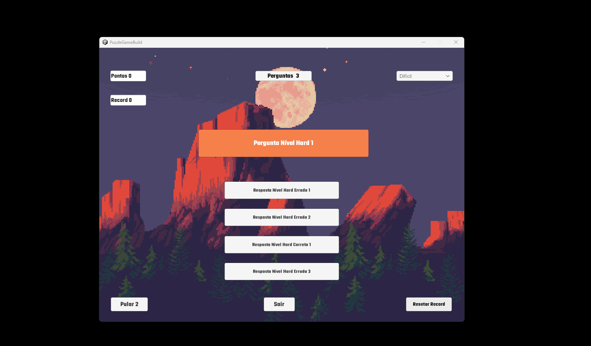
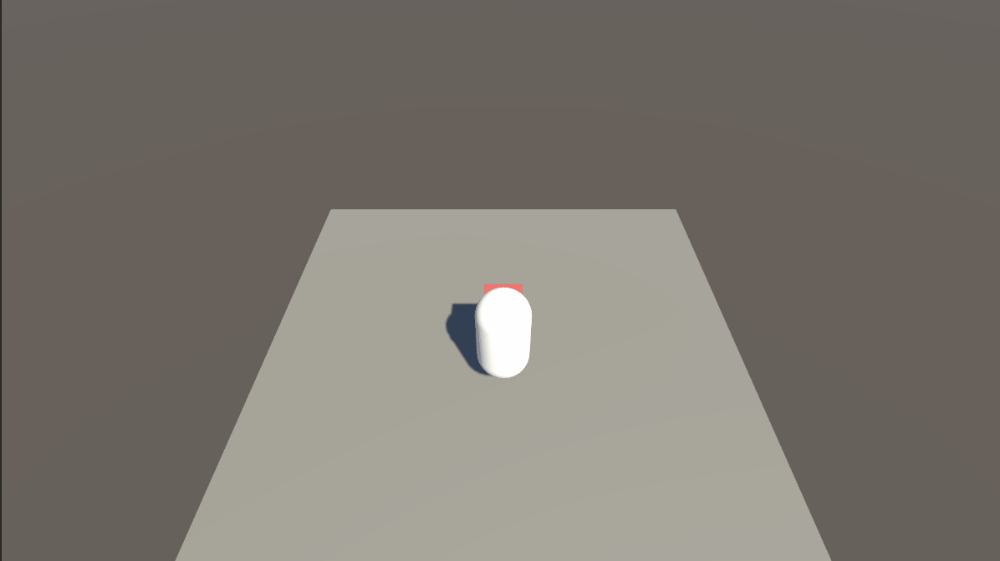

# Mentorama-Unity-Beginner

Curso: **Desenvolvedor de Games Unity** 
Módulo: **Iniciante** 
Versão do Unity: **2021.3.1** 
Arquivos das Atividades na Pasta: **Atividades**

## Módulo1

Primeira atividade: 
Explorar a unity: hierarquia,cena,layout e modificar elementos na cena.

## Módulo2

Segunda atividade: 
Criar uma cena GreyBox.

## Módulo3

Terceira atividade: 
Criar um script que recebe um valor monetário e calcula quantas cédulas serão devolvidas, priorizando sempre o maior valor da cédula.

## Módulo4

Quarta atividade: 
Criar UI com um toggle alternadno entre fullscreen e window mode, dropdown com diferntes resoluções e um botão para sair da aplicação.

## Módulo5

Quinta Atividade: 
Criar um jogo de puzzle de perguntas e respostas com diferentes níveis de dificuldade, pontuação, pontuação record e um botão de ajuda "pull up".

<a href="./Assets/Modulo5/">Assets do projeto</a>

## Módulo6 

Sexta Atividade: 
Criar transição de cenas, conforme o personagem avança, novas cenas são carregadas.

<a href="./Assets/Modulo6/">Assets do projeto </a>

## Módulo 7

Sétima Atividade: 

Desenvolver um jogo utilizando efeitos de física em que o personagem desvia de obstaculos.

<a href="./Assets/Modulo 7/">Assets do projeto</a>

