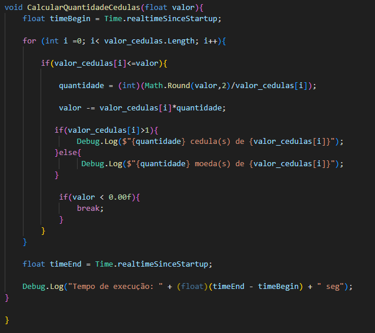

# Mentorama-Unity-Beginner

Curso: **Desenvolvedor de Games Unity** 
Módulo: **Iniciante** 
Versão do Unity: **2021.3.1** 

## Módulo1

Explorar a unity: hierarquia,cena,layout e modificar elementos na cena.

## Módulo2

Criar uma cena GreyBox.

## Módulo3

Criar um script que recebe um valor monetário e calcula quantas cédulas serão devolvidas, priorizando sempre o maior valor da cédula.

## Módulo4

Criar UI com um toggle alternadno entre fullscreen e window mode, dropdown com diferntes resoluções e um botão para sair da aplicação.

## Módulo5

Criar um jogo de puzzle de perguntas e respostas com diferentes níveis de dificuldade, pontuação, pontuação record e um botão de ajuda "pull up".

<a href="./Assets/Modulo5/">Assets do projeto</a>

## Módulo6 

Criar transição de cenas, conforme o personagem avança, novas cenas são carregadas.

<a href="./Assets/Modulo6/">Assets do projeto </a>

## Módulo 7

Desenvolver um jogo utilizando efeitos de física em que o personagem se mantem no ar conforme os clicks do mouse. 
Extras: obstaculos, caso personagem colida com eles o jogo reinicia, e capsulas que deixam o persongem ivuneravel aos obstaculos.

<a href="./Assets/Modulo 7/">Assets do projeto</a>

## Módulo 8

Importar Assets externos e testar materiais.

<a href="./Assets/Modulo8">Assets do projeto</a>

