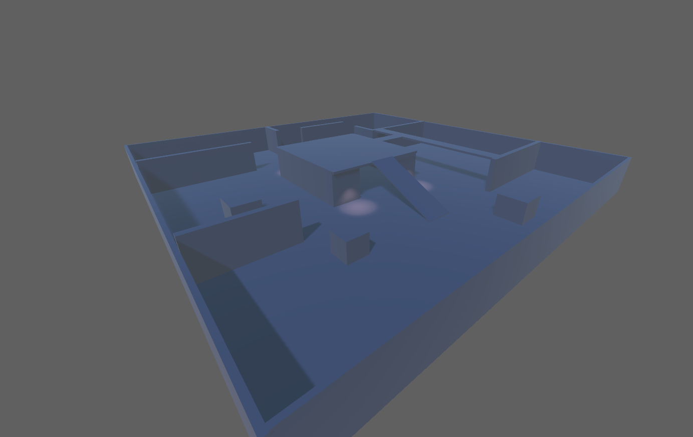

# Mentorama-Unity-Beginner

Curso: **Desenvolvedor de Games Unity** 
Módulo: **Iniciante** 
Versão do Unity: **2021.3.1** 
Arquivos das Atividades na Pasta: **Atividades**

## Módulo1

Primeira atividade: 
Explorar a unity: hierarquia,cena,layout e modificar elementos na cena.

## Módulo2

Segunda atividade: 
Criar uma cena GreyBox.

## Módulo3

Terceira atividade: 
Criar um script que recebe um valor monetário e calcula quantas cédulas serâo devolvidas, priorizando sempre o maior valor da cédula.

